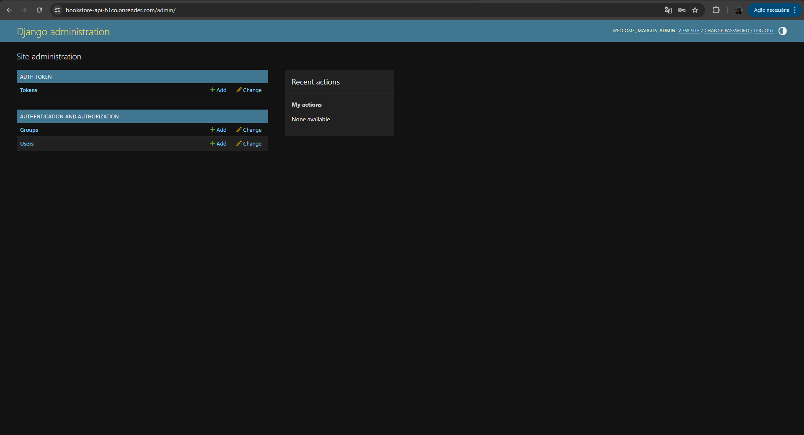

<h1 align="center">
  Bookstore API - Django REST & Docker
</h1>

<div align="center">
  
</div>

# 📚 Bookstore API - Django REST & Docker

Este projeto é uma API robusta para gerenciamento de livraria, desenvolvida com **Django REST Framework**. O objetivo principal deste projeto foi consolidar conhecimentos em **containerização**, **gerenciamento de dependências com Poetry** e **deploy contínuo em ambiente de produção**.

---

## 🚀 Desafios Técnicos e Aprendizados

O maior valor deste projeto não está apenas nas rotas da API, mas na infraestrutura que a sustenta. Durante o desenvolvimento e deploy, resolvi desafios complexos de DevOps:

- **Otimização de Docker com Poetry**: Configurei o ambiente Docker para instalar dependências diretamente no sistema da imagem (`virtualenvs.create false`), garantindo um runtime mais leve e evitando conflitos comuns de ambientes virtuais isolados em containers.
- **Gestão de Estáticos com WhiteNoise**: Implementei o WhiteNoise para que o Django fosse capaz de servir seus próprios arquivos estáticos (CSS/JS) em produção, eliminando a necessidade de um servidor Nginx separado para este fim.
- **Automação de Inicialização**: Desenvolvi scripts via `CMD` no Dockerfile para garantir que as migrações de banco de dados e a criação de superusuários administrativos ocorressem de forma atômica no momento do boot do container.

---
### ⚙️ CI/CD & Automação

O projeto utiliza um pipeline de **Continuous Deployment (CD)** integrado ao Render. 
- **Build Automatizado:** O ambiente é reconstruído via Docker a cada novo push no branch `main`.
- **Zero Downtime:** O deploy só é finalizado se todos os comandos do `CMD` (migrations, staticfiles) forem executados com sucesso, garantindo que o site nunca fique fora do ar por erros de build.
---
### 🧪 GitHub Actions (Continuous Integration)

Implementei um workflow de **CI** utilizando GitHub Actions que é disparado a cada `push` ou `pull request`:
- **Linter & Style:** Verificação automática de padrões de código (PEP8) para manter a consistência.
- **Automated Testing:** Execução da suíte de testes do Django para garantir que nenhuma nova funcionalidade quebre o que já está rodando.
- **Build Check:** Validação do ambiente Poetry e instalação de dependências antes da integração com o branch principal.
---

### 🛠️ Tecnologias Utilizadas

- **Backend:** Python 3.13, Django 5.x, Django REST Framework.
- **Gerenciador de Dependências:** Poetry.
- **Banco de Dados:** PostgreSQL (Produção).
- **Infraestrutura:** Docker & Docker Compose.
- **Deploy:** Render.
- **Servidor de Estáticos:** WhiteNoise.

---

### 📦 Como rodar o projeto localmente

1. **Clone o repositório:**
```bash
git clone [https://github.com/Rinkashi17/bookstore-api.git](https://github.com/Rinkashi17/bookstore-api.git)
cd bookstore-api
```
2. **Utilizando Docker (Recomendado):**
```bash
docker-compose up --build
```
3. **Utilizando Poetry (Local):**
```bash
poetry install
poetry run python manage.py migrate
poetry run python manage.py runserver
```

👤 Autor
Marcos Alessandro (Rinkashi17)

LinkedIn: https://www.linkedin.com/in/rinkashi17/

Foco: Desenvolvimento Full Stack | React | TypeScript | Django
